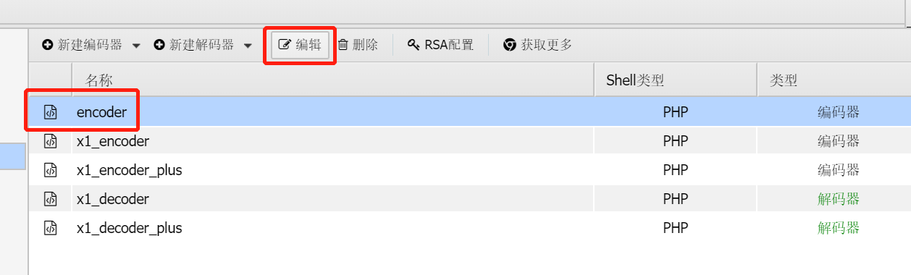
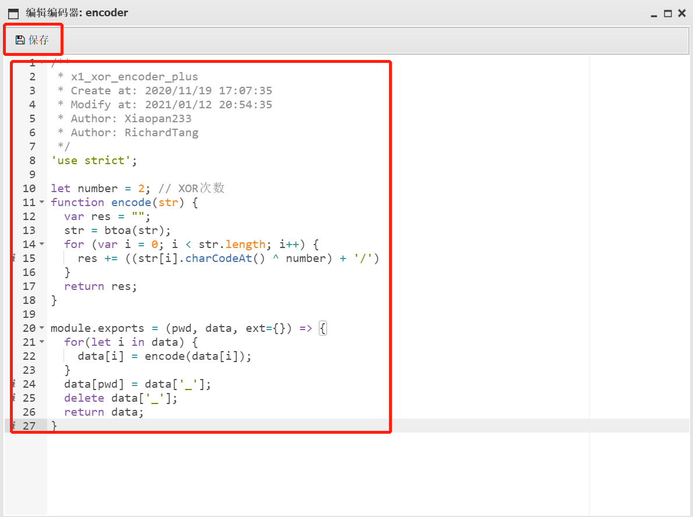
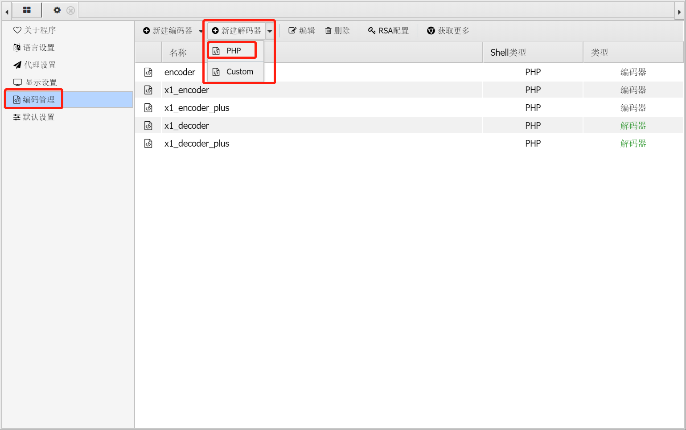
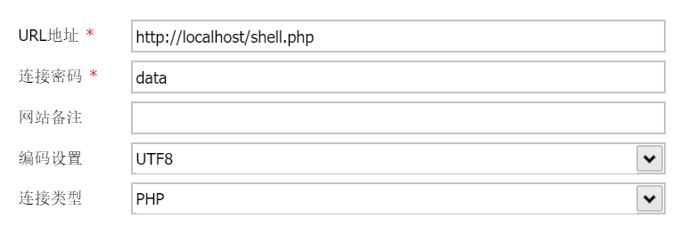
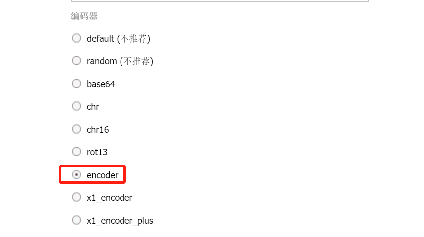
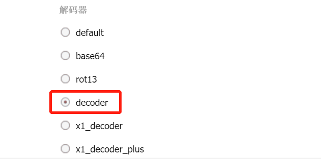
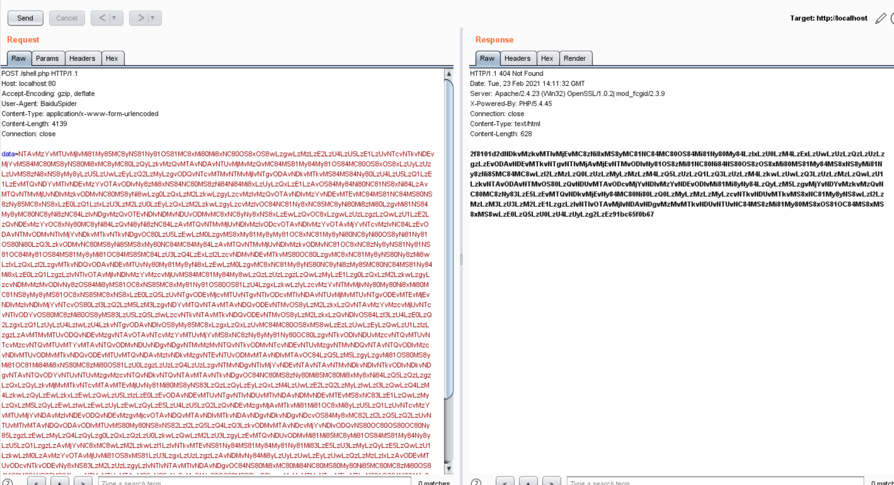
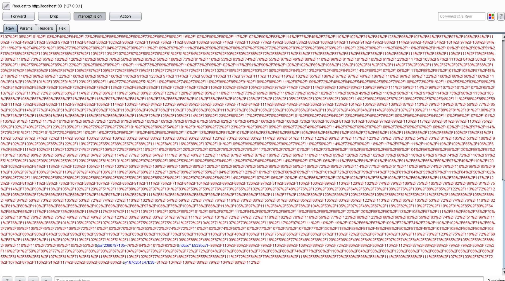
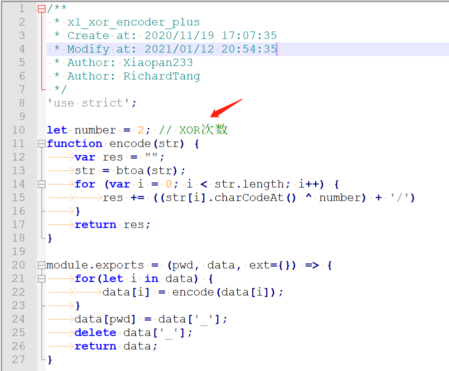

# 介绍

AntSword(蚁剑)全参数流量XOR，基于[AntSword-Cryption-WebShell](https://github.com/xiaopan233/AntSword-Cryption-WebShell/tree/main/php)基础上进行改造，主要用来逃避一些特征检测。

# 使用

打开蚁剑 ---> 左上角AntSword ---> 系统设置

## 编码器

自定义一个名称，后将encoder.js中的内容粘贴进去并保存。

## 解码器

将decoder.js中的内容粘贴进去并保存，操作和编码器类似。

## 连接

将提供好的WebShell进行上传，需要更换密码的请修改`$pass`变量的值即可。

指定好编码器和解码器

# 效果

WebShell访问效果

# 更新

## 2021年2月23日

增加WebShell伪装，更多的XOR次数，Base64编码传输。

# 注意点

encoder/decoder/shell中xor次数需要保持一致

`在传输一些不可见字符时候可能会出现使用不正常的情况`
