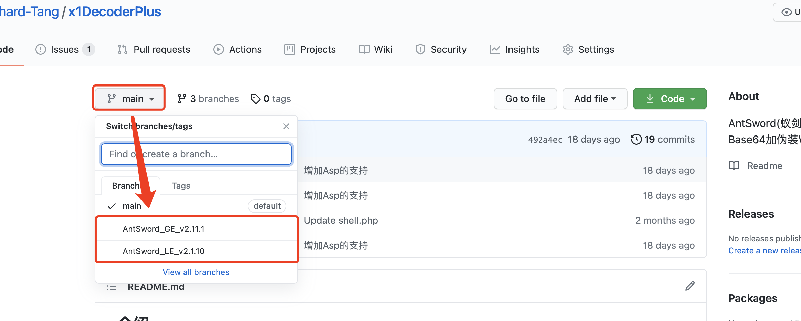

## 介绍

AntSword(蚁剑)全参数流量XOR+Base64，基于[AntSword-Cryption-WebShell](https://github.com/xiaopan233/AntSword-Cryption-WebShell/tree/main/php)基础上进行改造，主要用来逃避一些流量检测。

## 使用

根据自己蚁剑的版本切换分支

AntSword_GE_v2.1.11 `大于等于v2.1.11`

AntSword_LE_v2.1.10 `小于等于2.1.10`

## 更新

### 2021年5月14日

jsp支持蚁剑v2.1.11版

### 2021年4月27日

增加Asp支持(基础功能没问题，不排除会有Bug，欢迎提交issue。)

### 2021年2月28日

增加Jsp支持

### 2021年2月23日

增加WebShell伪装，增大XOR-Key值，加多一层Base64编码传输。
