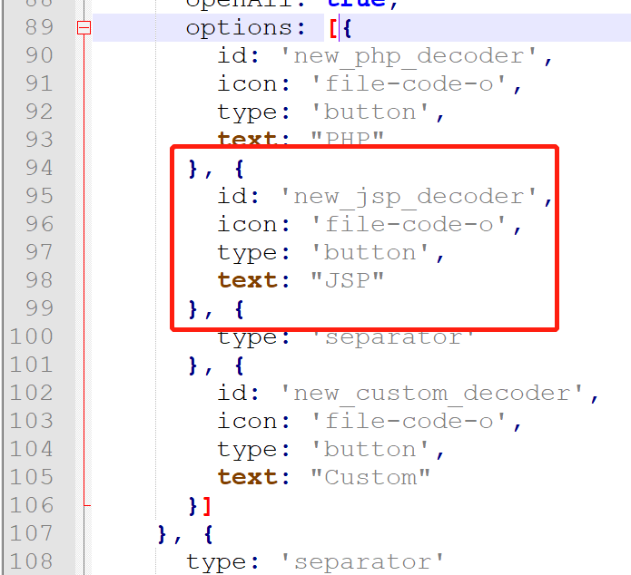
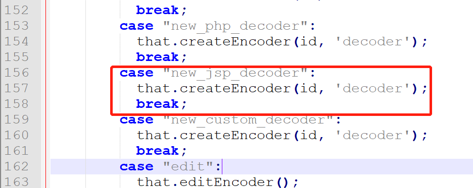
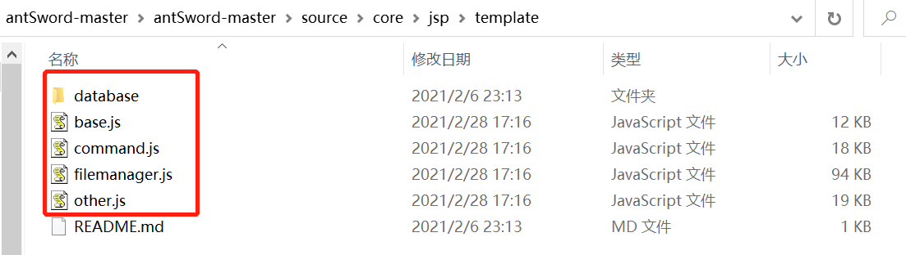
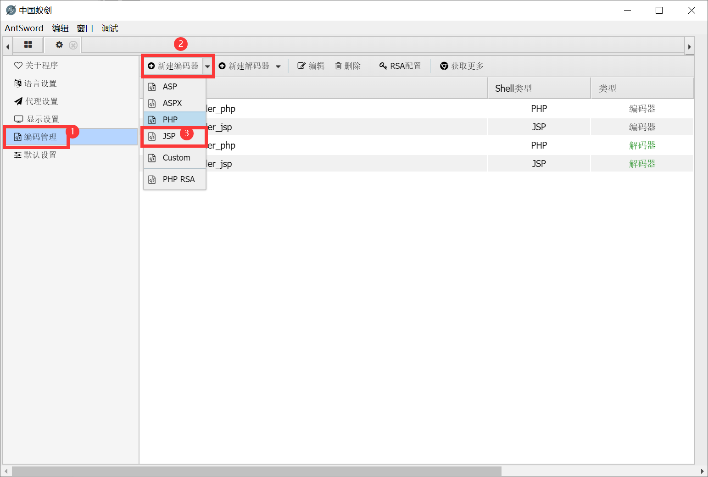
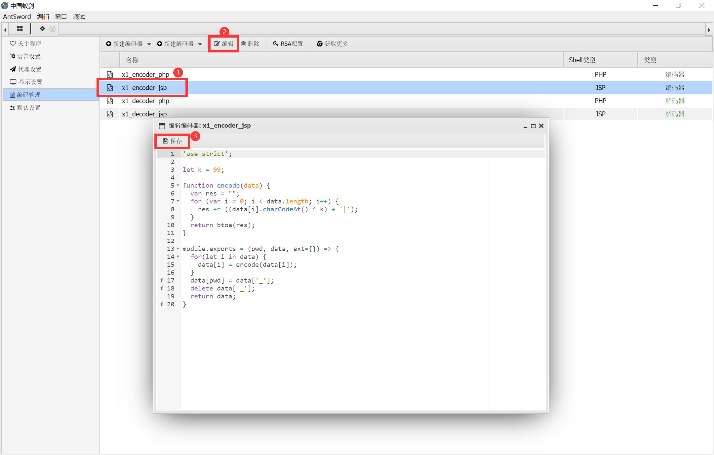
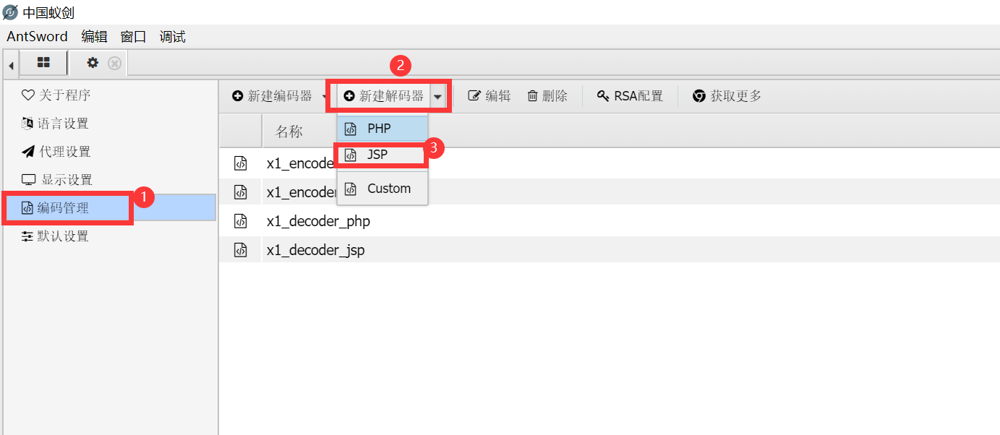
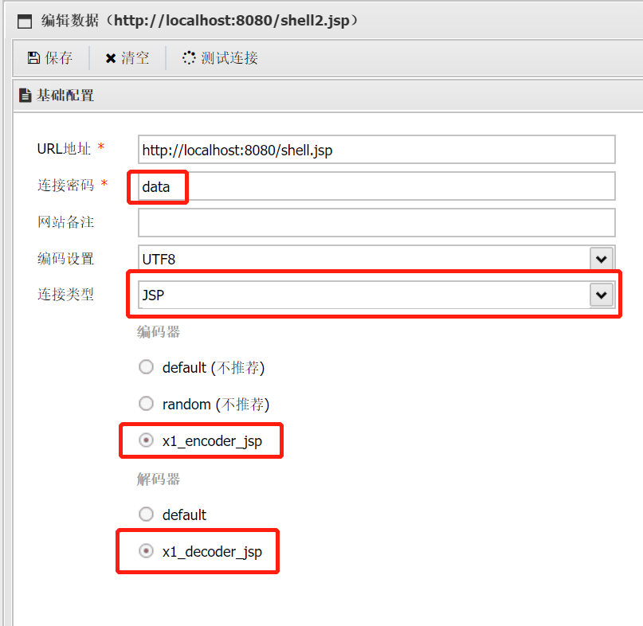
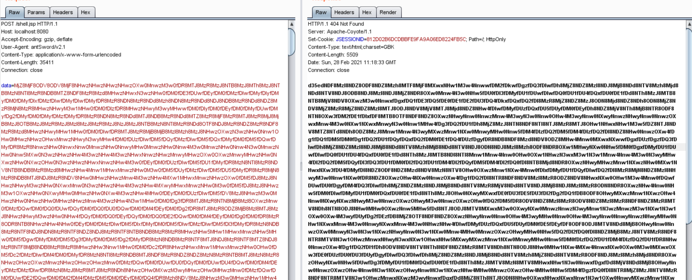
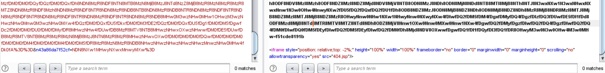
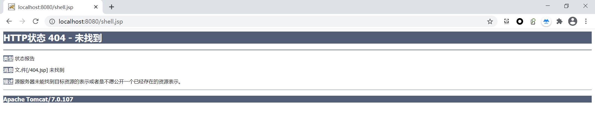

## 使用

对Jsp配置麻烦一些，按照下边步骤进行配置。

### 增加Jsp解码器

找到`蚁剑的初始化目录\source\modules\settings\encoders.js`文件

在第89行~106行之间加入如下配置，==注意逗号==。

```json
{
    id: 'new_jsp_decoder',
    icon: 'file-code-o',
    type: 'button',
    text: "JSP"
}
```




156行~158行加入如下代码

```javascript
case "new_jsp_decoder":
	that.createEncoder(id, 'decoder');
	break;
```



### 覆盖模板

==建议将`template`文件夹拷贝一份出来做备份。==

将提供好的template文件夹内的文件覆盖到下边的目录中

`蚁剑的初始化目录\source\core\jsp\template\`



==如果蚁剑已开启了，记得重启！==

### 编码器

点击左上角AntSword ---> 系统设置



自定义一个名称，后将encoder.js中的内容粘贴进去并保存。



### 解码器

将decoder.js中的内容粘贴进去并保存，操作和编码器类似。



## 连接

默认密码: `data`

将提供好的WebShell进行上传，需要更换密码在WebShell文件中搜索`data`，然后替换值即可。



## 效果





WebShell访问效果


