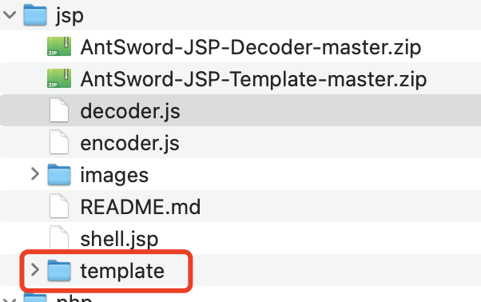
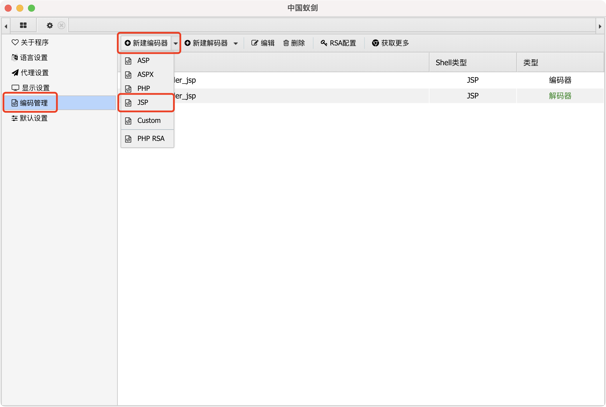
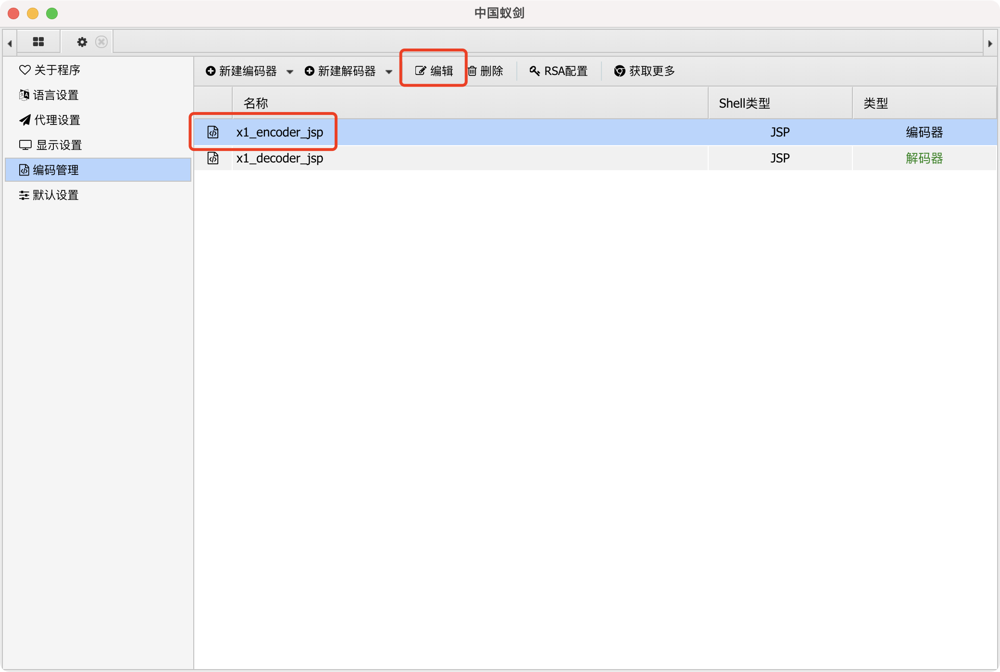
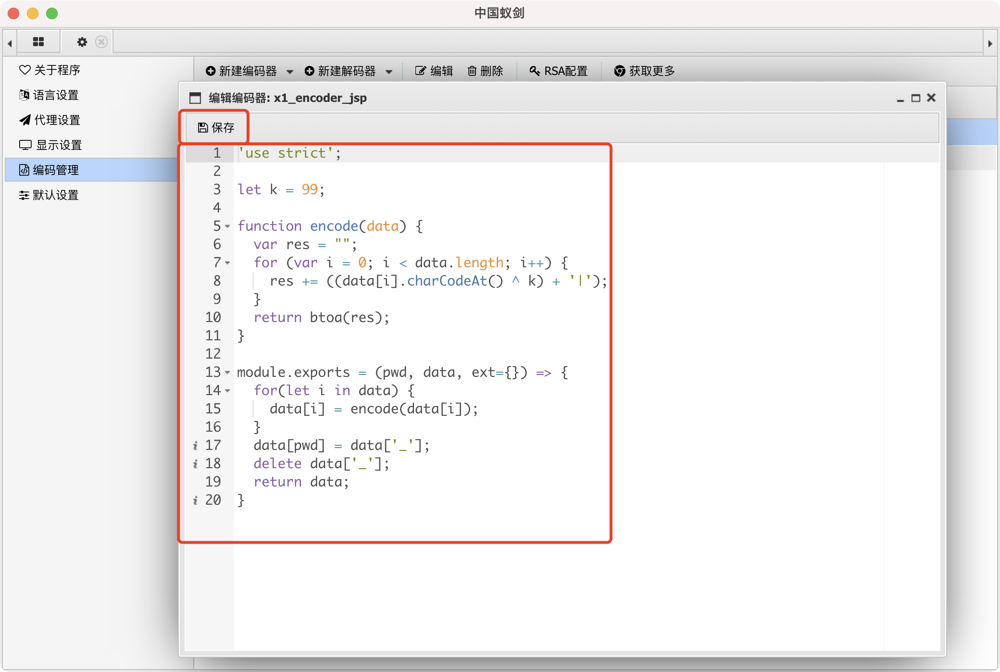
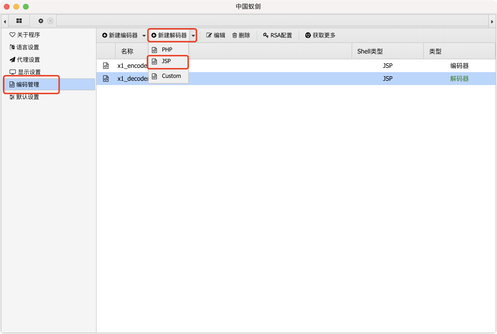
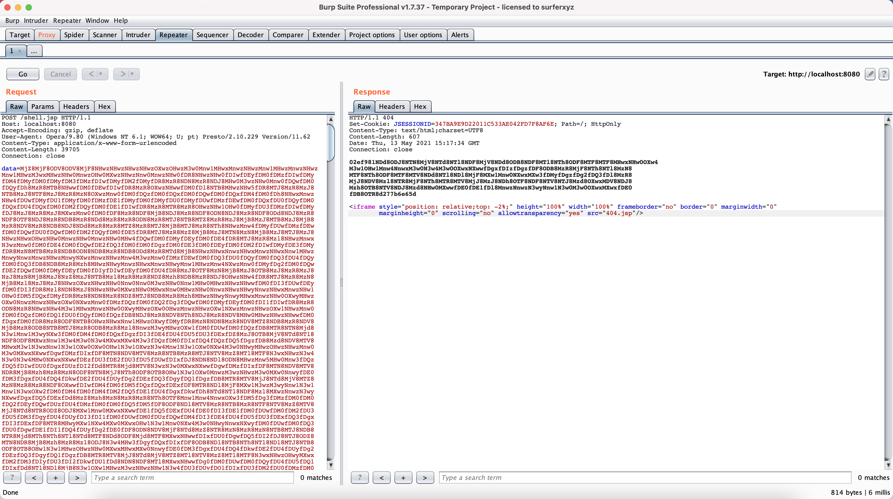
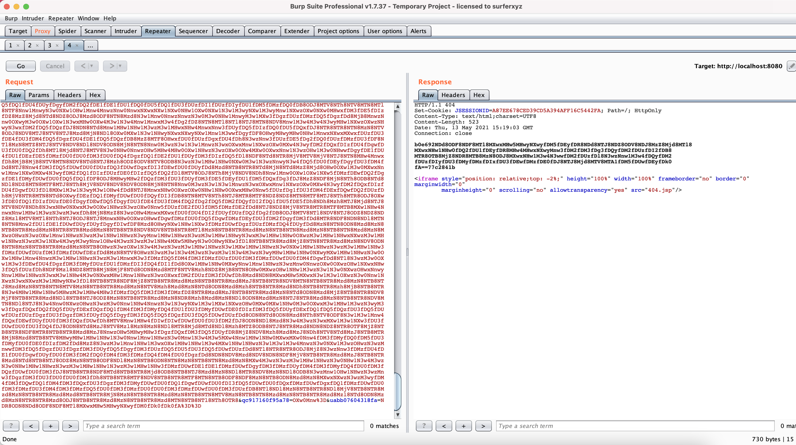

## 说明

* 模版和解码器模版
  * AntSword-JSP-Decoder-master.zip
  * AntSword-JSP-Template-master.zip

## 使用

打开蚁剑 ---> 左上角AntSword ---> 系统设置

### 覆盖模版

建议将`jsp`文件夹拷贝一份出来做备份

将提供好的template文件夹覆盖到`蚁剑的初始化目录\source\core\jsp\`目录中

### 编码器

自定义一个名称，后将encoder.js中的内容粘贴进去并保存。

### 解码器

将decoder.js中的内容粘贴进去并保存，操作和编码器类似。

## 连接

默认密码: `data`

将提供好的WebShell进行上传，需要更换密码的请修改WebShell中的`request.getParameter("data")`。

## 效果

WebShell访问效果

