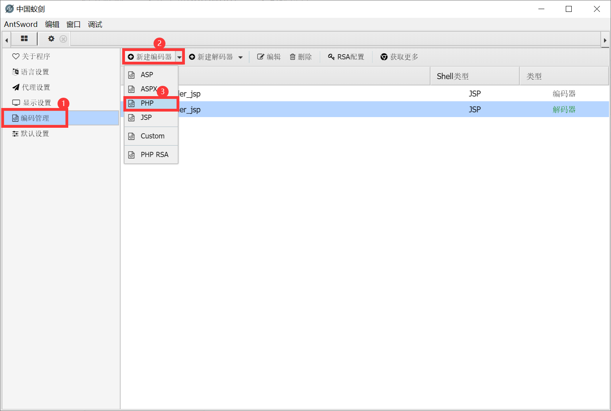
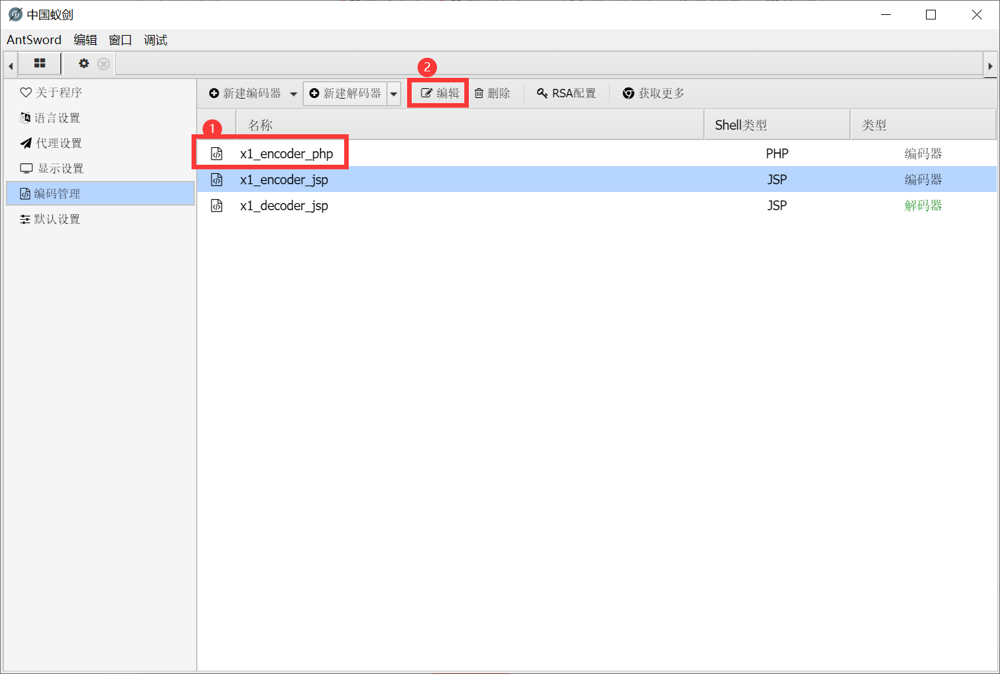
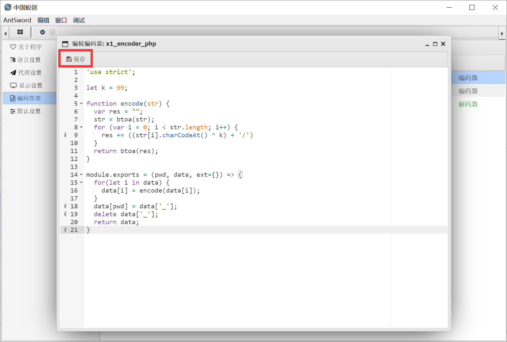
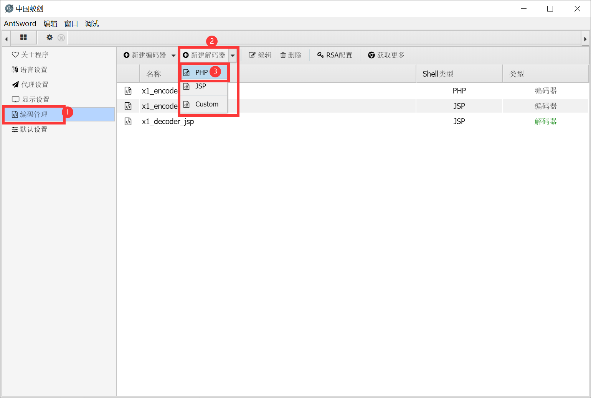
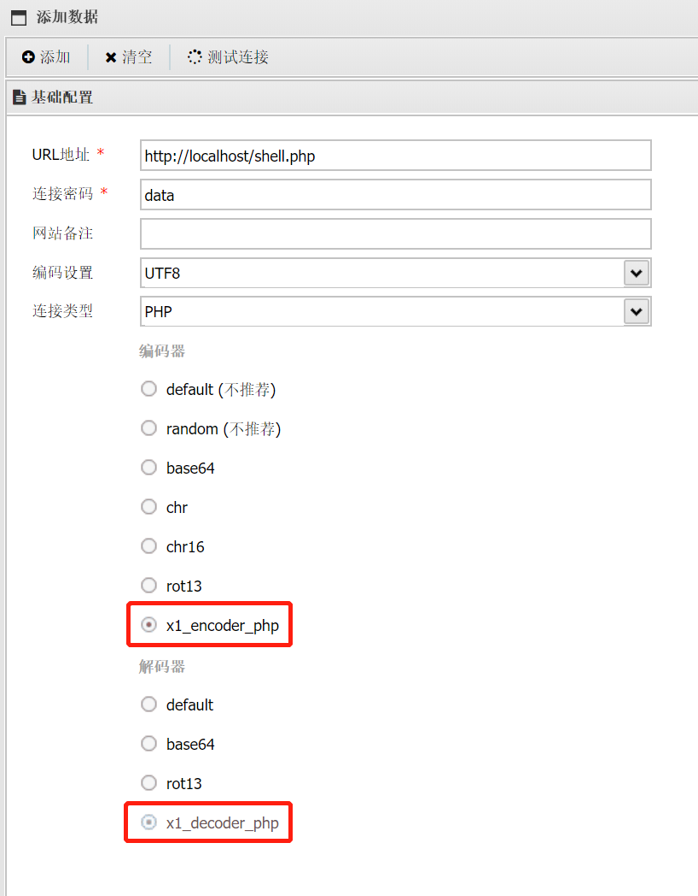
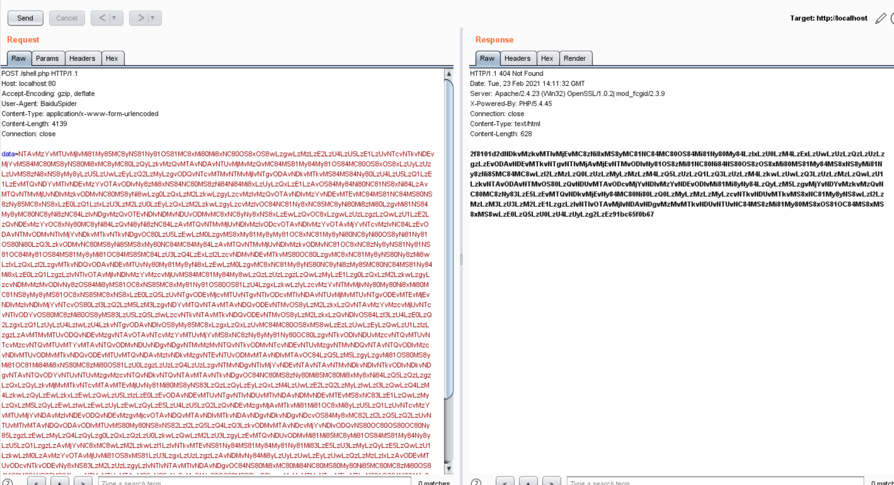
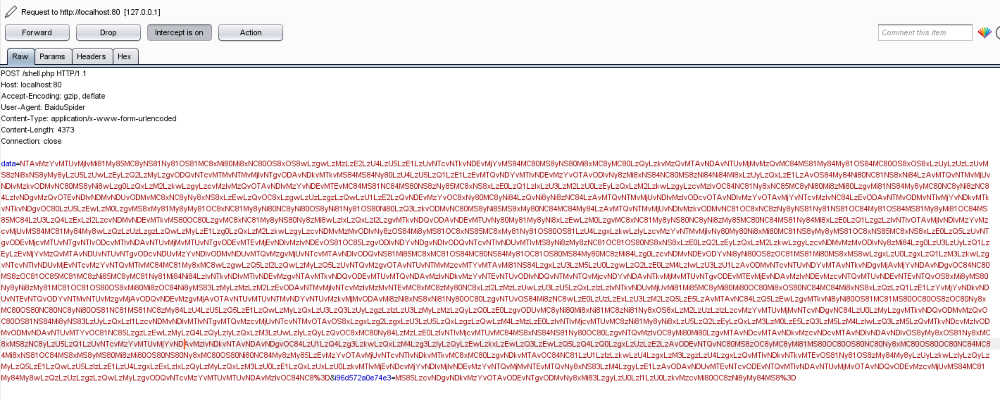
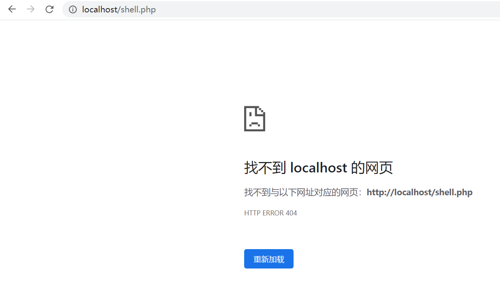

## 使用

打开蚁剑 ---> 左上角AntSword ---> 系统设置

### 编码器

自定义一个名称，后将encoder.js中的内容粘贴进去并保存。

### 解码器

将decoder.js中的内容粘贴进去并保存，操作和编码器类似。

## 连接

默认密码: `data`

将提供好的WebShell进行上传，需要更换密码的请修改WebShell中的`$pass`变量的值即可。

## 效果

WebShell访问效果

